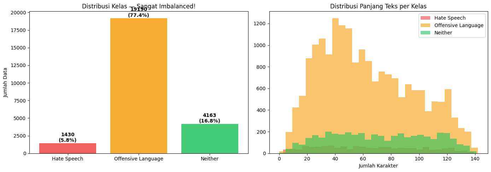
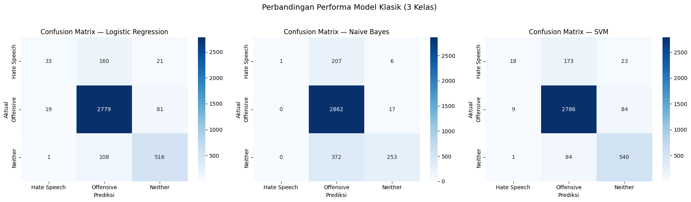
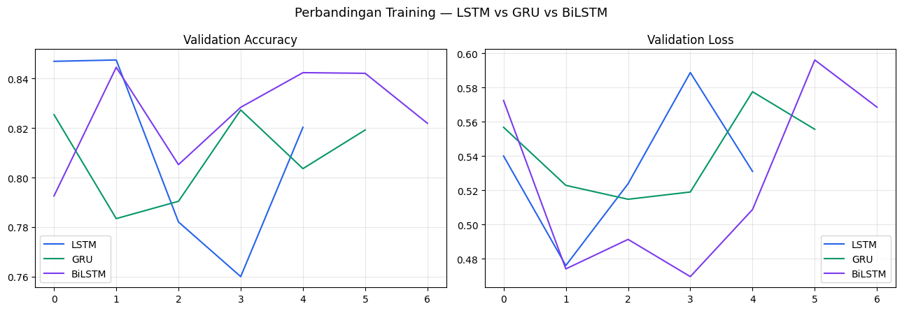
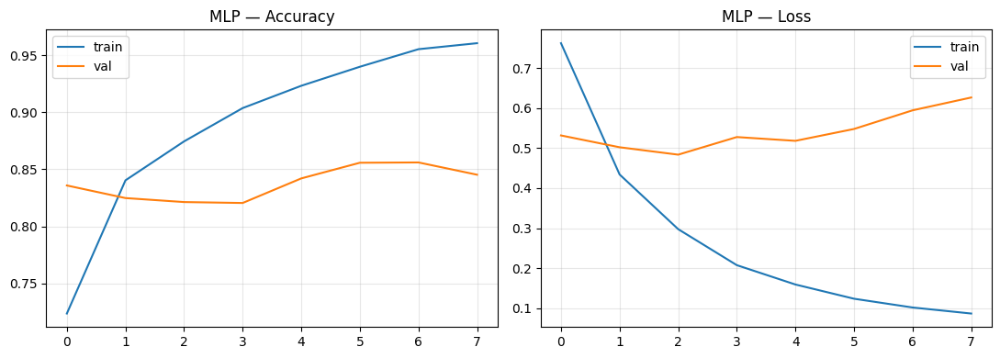
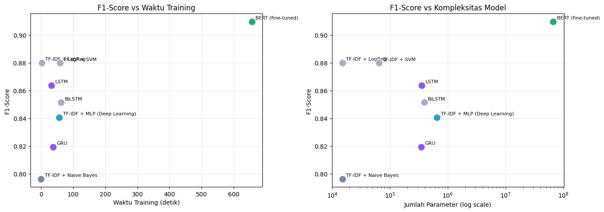
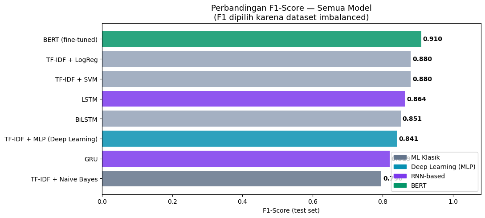
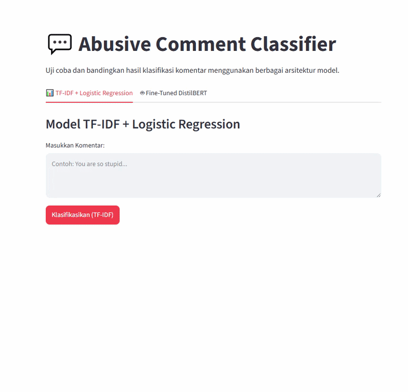

# SocialMedia-Toxicity-Classifier
End-to-end NLP pipeline classifying social media text into hate speech, offensive language, and neither. Benchmarks classical ML (LogReg, SVM), sequential models (LSTM, GRU, BiLSTM), and a fine-tuned DistilBERT transformer.

# Multi-Class Social Media Toxicity Classifier

This repository implements an end-to-end machine learning and deep learning pipeline for multi-class social media toxicity classification. The project classifies text into three categories: **Hate Speech**, **Offensive Language**, and **Neither**, leveraging the Kaggle dataset (`mrmorj/hate-speech-and-offensive-language-dataset`).

---

## 📊 Dataset & Preprocessing Pipeline

The pipeline processes raw social media comments by removing URLs, mentions (`@`), hashtags, and non-alphabet characters, and normalizing text to lowercase. To handle class imbalance, a stratified split is applied across train, validation, and test sets.

* **Train Set:** 17,348 samples
* **Validation Set:** 3,717 samples
* **Test Set:** 3,718 samples
* **Class Balance Status:** Stratified successfully; proportions are preserved across all splits.

### Distribution & Text Length Graph

Hate Speech (Class 0): ~1,430 samples (5.8%)
Offensive Language (Class 1): ~19,190 samples (77.4%)
Neither (Class 2): ~4,163 samples (16.8%)
Status: Highly Imbalanced dataset requiring class weights or stratified metrics.

## 🛠️ 1. Classical Machine Learning Models (TF-IDF)

Text features are extracted using `TfidfVectorizer` (max features = 5,000, English stop words removed). Models evaluated include Logistic Regression, Multinomial Naive Bayes, and Support Vector Machine (SVM).

---

### Benchmark Results
| Model | Accuracy | Precision (Weighted) | Recall (Weighted) | F1-Score (Weighted) | Training Time | Inference Time |
| :--- | :---: | :---: | :---: | :---: | :---: | :---: |
| **TF-IDF + SVM** | **89.94%** | **88.62%** | **89.94%** | **87.99%** | 58.54s | 0.76 ms |
| **TF-IDF + LogReg** | 89.51% | 88.24% | 89.51% | 88.00% | 2.25s | 0.00 ms |
| **TF-IDF + Naive Bayes** | 83.81% | 85.57% | 83.81% | 79.63% | 0.03s | 0.00 ms |

### Confusion Matrix Heatmap

* **Insight:** Logistic Regression and SVM handle the dominant "Offensive Language" and "Neither" classes exceptionally well, whereas "Hate Speech" suffers higher confusion due to limited sample representation.

---

## 🧠 2. Deep Learning — Multi-Layer Perceptron (MLP)

A fully-connected feedforward neural network built on top of dense TF-IDF vectors, featuring Dropout regularization and computed class weights to counteract severe class imbalance.

### Architecture Summary
* **Input Layer:** 5,000 features (Dense TF-IDF)
* **Hidden Layers:** 
  * Dense (128, ReLU) + Dropout (0.4)
  * Dense (64, ReLU) + Dropout (0.3)
  * Dense (64, ReLU) + Dropout (0.3)
* **Output Layer:** Dense (3, Softmax)
* **Total Parameters:** 652,739 (Trainable: 652,739)

### Benchmark Results
* **Accuracy:** 81.90%
* **Precision (Weighted):** 88.00%
* **Recall (Weighted):** 81.90%
* **F1-Score (Weighted):** 84.08%
* **Training Time:** 57.06s (Stopped at Epoch 8 via Early Stopping)
* **Inference Time:** 0.82 ms/sample

### Training Curve & Loss/Accuracy Graph

Accuracy Curve: Train climbs rapidly to >96%, while validation accuracy stabilizes around 82% - 85%.
Loss Curve: Validation loss reaches its minimum around Epoch 2–3 before rising, triggering Early Stopping at Epoch 8 to prevent overfitting.

---

## 🔄 3. RNN-Based Models (LSTM, GRU, BiLSTM)

Unlike TF-IDF and MLP which treat text as a bag-of-words, sequential models process tokens step-by-step to capture word ordering and contextual dependencies. Texts are tokenized and padded to a maximum length of 100 tokens with an embedding dimension of 64.

### Benchmark Results
| Model | Accuracy | Precision (Weighted) | Recall (Weighted) | F1-Score (Weighted) | Training Time | Inference Time | Parameters |
| :--- | :---: | :---: | :---: | :---: | :---: | :---: | :---: |
| **LSTM** | **0.8480** | **0.8943** | **0.8480** | **0.8637** | 32.23s | 0.0004s | 355,203 |
| **BiLSTM** | 0.8319 | 0.8827 | 0.8319 | 0.8514 | 62.07s | 0.0004s | 390,275 |
| **GRU** | 0.7832 | 0.8894 | 0.7832 | 0.8194 | 37.59s | 0.0003s | 347,139 |

### Model Analysis & Findings
* **LSTM (Long Short-Term Memory):** Performed best among the sequential architectures with an F1-score of **86.37%** and an accuracy of **84.80%**, striking a solid balance between model capacity and training efficiency.
* **BiLSTM (Bidirectional LSTM):** Despite reading text in both forward and backward directions, it yielded slightly lower accuracy (**83.19%**) and required nearly double the training time (62.07s) due to increased recurrent state complexity.
* **GRU (Gated Recurrent Unit):** Trained efficiently with 347,139 parameters, but underperformed compared to LSTM on this specific dataset, scoring an accuracy of **78.32%**.
* **Insight on Sequence vs. Frequency:** While RNN models capture word sequence, social media toxicity often relies heavily on specific offensive keywords or slurs rather than long-range syntactic dependencies. This explains why simpler, frequency-based classical models (like TF-IDF + SVM/LogReg) outperformed basic recurrent architectures.

---

## 📊 4. Comprehensive Model Benchmark & Comparison

The table below summarizes the performance, training time, inference speed, and parameter size of all implemented models, evaluated on the test set.

| Model | Accuracy | Precision (Weighted) | Recall (Weighted) | F1-Score (Weighted) | Training Time | Inference Time | Parameters |
| :--- | :---: | :---: | :---: | :---: | :---: | :---: | :---: |
| **BERT (fine-tuned)** | **0.9069** | **0.9141** | **0.9069** | **0.9098** | 657.06s | 0.0040s | 66,955,779 |
| **TF-IDF + SVM** | 0.8994 | 0.8862 | 0.8994 | 0.8799 | 58.54s | 0.0008s | 64,673 |
| **TF-IDF + LogReg** | 0.8951 | 0.8824 | 0.8951 | 0.8800 | **2.25s** | **0.0000s** | **15,003** |
| **LSTM** | 0.8480 | 0.8943 | 0.8480 | 0.8637 | 32.23s | 0.0004s | 355,203 |
| **BiLSTM** | 0.8319 | 0.8827 | 0.8319 | 0.8514 | 62.07s | 0.0004s | 390,275 |
| **TF-IDF + MLP (Deep Learning)** | 0.8190 | 0.8800 | 0.8190 | 0.8408 | 57.06s | 0.0008s | 652,739 |
| **GRU** | 0.7832 | 0.8894 | 0.7832 | 0.8194 | 37.59s | 0.0003s | 347,139 |
| **TF-IDF + Naive Bayes** | 0.8381 | 0.8557 | 0.8381 | 0.7963 | **0.03s** | **0.0000s** | **15,003** |

### Benchmark Analysis & Key Insights

* **Top Performer (BERT Fine-Tuned):** Achieved the highest accuracy (**90.69%**) and F1-score (**90.98%**) by leveraging deep bidirectional context through self-attention mechanisms. However, it requires significant computing resources (~657 seconds of training time and over 66 million parameters).
* **High-Efficiency Baseline (TF-IDF + Logistic Regression / SVM):** Classical machine learning models running on simple sparse TF-IDF features deliver surprisingly powerful results. **TF-IDF + SVM** hits **89.94%** accuracy, while **Logistic Regression** achieves **89.51%** accuracy with an ultra-fast training time of just **2.25 seconds** and only **15,003 parameters**, making it ideal for lightweight production deployment.
* **Recurrent Neural Networks (LSTM, BiLSTM, GRU):** While sequential architectures account for word order, they fell behind classical models. This suggests that social media toxicity detection heavily relies on specific lexical indicators and hate keywords rather than complex syntactic dependencies over time.
* **Multi-Layer Perceptron (MLP):** Fully-connected layers over dense TF-IDF vectors scored **81.90%** accuracy. Despite having 652,739 parameters, it showed signs of overfitting earlier and required strict early stopping compared to linear classifiers.

---

### 🚀 Live Brief Demo

